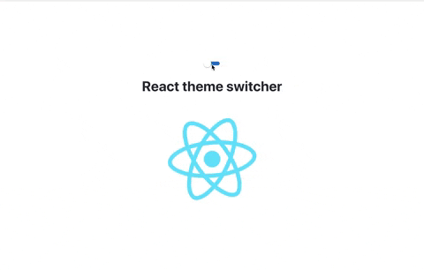

# React theme switcher component

> A react theme switcher component

## Installation

```bash
# using yarn
yarn add react-theme-switcher

# using npm
npm install react-theme-switcher
```

## Usage

By default theme switcher is applied to body and colors are already setted

```js
import React from "react";
import ThemeSwitcher from "react-theme-switcher";

function App() {
  return (
    <div className="App">
      <header className="App-header">
        <ThemeSwitcher />
        <h2>React theme switcher</h2>
      </header>
    </div>
  );
}

export default App;
```

Props you can pass to the component:

```js
<ThemeSwitcher
    cssSelector="body"
    darkColor="#282c34"
    lightColor="#ffffff"
    buttonColor="#ffffff"
    switchColor="#2775cc"
    lightTextColor="#272b33"
    darkTextColor="#ffffff"
/>
```

## Demo

Preview it on CodeSandbox <https://codesandbox.io/s/6yr87ozmkk>



## Author

[Abdessalam BENHARIRA](https://github.com/Abdessalam98)
